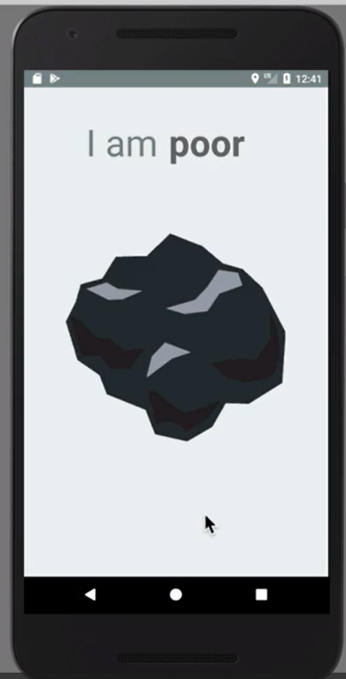

# Lab 3: Android App Development

## Task Overview
In this lab, students will create a simple Android application that replicates the given screenshot using **RelativeLayout**. The application should include **TextViews, ImageViews, and proper color values** to match the given design. Additionally, students must write a short explanation of **RelativeLayout**, describing its features and why it is used in the app layout.

## Learning Objectives
By completing this lab, students will:
- Understand and apply **RelativeLayout** in Android UI design.
- Use **TextView** and **ImageView** components effectively.
- Implement proper **color values** and **layout attributes**.
- Use **CustomLogo** from the **Assets** folder.
- Gain hands-on experience in XML layout designing.

## Lab Requirements
### 1. Application Layout
- Use **RelativeLayout** as the root layout.
- Include **TextViews** and **ImageViews** to match the design.
- Properly align components using **layout attributes**.
- Apply **color values** from resources (`res/values/colors.xml`).

### 2. Explanation of RelativeLayout
- Write a short paragraph (5-7 sentences) explaining **RelativeLayout**.
- Describe its **advantages** and **when to use it**.
- Save this explanation as a **comment** in the XML file.

### 3. Submission Guidelines
- Save the complete project folder in your PC.
- Ensure proper **indentation** and **comments** in the XML file.
- Show the final **output** on the Emulator/phone.

## Questions for Students
1. What is **RelativeLayout**, and how does it differ from **LinearLayout**?
2. How do you align a **TextView** below an **ImageView** in **RelativeLayout**?
3. What XML attributes are used to center an element **horizontally and vertically**?
4. Why should we use **color resources** instead of hardcoded colors in XML?
5. How can you **scale an ImageView** properly while maintaining its aspect ratio?

---

