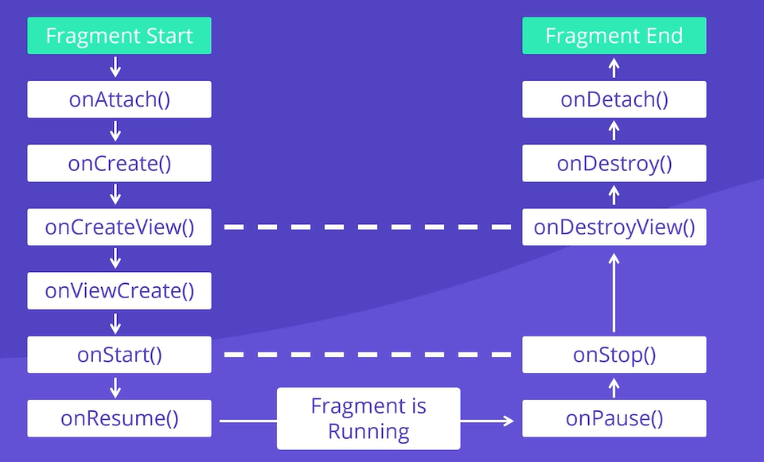

# 🧪 Android Application Development Lab

## 📘 Topics Covered
- Fragments
- Services
- Broadcast Receivers

---

## 👶 Introduction

Think of your Android phone like a **magic toy** that can do many things — show games, messages, songs, or even weather updates.

In this lab, we’ll learn about:
- **Fragments**: Little pieces of an app
- **Services**: Invisible helpers
- **Broadcast Receivers**: Message listeners

---

## 🧩 Part 1: Fragments and Their Lifecycle

### 🧠 What is a Fragment?

A **Fragment** is like a mini screen inside a big screen.  
Imagine your tablet screen is divided into two parts:
- The top shows your game
- The bottom shows your score  
Each part is a **Fragment**.

---

### 🌀 Fragment Lifecycle (Like a Plant's Life)

| Lifecycle Method | Meaning (Simple)              |
|------------------|-------------------------------|
| `onAttach()`     | 🌱 The seed is placed in soil |
| `onCreate()`     | 🌿 The seed starts growing     |
| `onCreateView()` | 🍃 Leaves appear (UI shows)    |
| `onActivityCreated()` | 🌼 Becomes part of the garden (Activity) |
| `onStart()`      | 🌞 It grows more              |
| `onResume()`     | 🎉 Ready for action           |
| `onPause()`      | 💤 Takes a break               |
| `onStop()`       | 👋 Not visible anymore        |
| `onDestroyView()`| 🍂 Leaves fall off (UI goes)  |
| `onDetach()`     | 🪴 Removed from the soil      |

---

### 🛠 Lab Task: Create a Fragment-Based App

#### Objective:
- Create an app with **Fragment**:
  - **Fragment** should contain a textview containing some text.
  - Implement each method of Fragment Lifecycle.

---

## ⚙️ Part 2: Services in Android

### 🧠 What is a Service?

A **Service** is an application component that can perform long running operation in background. It do not provide a User Interface. Another application component can start a service.
A **Service** is like a **robot** that works in the background.  
You don’t see it, but it's doing its job — like playing music or downloading files.
- **Services** are a core component of Android used to perform **long-running operations in the background**.
- Unlike Activities, **Services do not have a User Interface (UI)**.
- They are essential when tasks need to run without user interaction.

---

## 🧠 Key Features
- Runs **in the background**.
- **No UI** – doesn't interact with users directly.
- Can be started by other components like **buttons** or **activities**.
- Examples: file download, music playback, photo upload.

---

## 🔄 Real-World Examples
1. **File Download**:
   - Click a button → service starts downloading in the background.
   - User continues using the app while download happens.
   - No UI required; might show a notification.

2. **Music Player**:
   - Music keeps playing even when the app is minimized.
   - Service handles playback in the background.

3. **Photo Compression**:
   - App stores and compresses photos silently in the background.
   - No user interaction required.

---

## 🧩 Types of Android Services

### 1. 🚀 Foreground Service
- Runs in background **but shows a notification** to the user.
- Example: Download manager, music player.
- Must display status or progress to user.
- **Continues running** even if the user leaves the app.

### 2. 🌙 Background Service
- Runs silently **without showing notification**.
- Used for tasks like **photo compression** or **data syncing**.
- User is usually unaware it’s running.
- Limited by Android for battery optimization.

### 3. 🔗 Bound Service
- **Tightly coupled** with the component (activity/fragment) that started it.
- When the calling component stops, **service stops too**.
- Maintains a **client-server relationship**.
- Example: Music app where UI updates current track info via service.

---

## ⚙️ Summary

| Feature                 | Foreground               | Background             | Bound                       |
|------------------------|--------------------------|------------------------|-----------------------------|
| User Notification       | Yes                      | No                     | Optional (Depends on UI)    |
| Continues when app exits| Yes                      | Depends on version     | No                          |
| User Interaction        | Minimal                  | None                   | Frequent                    |
| Examples                | Music Player, Downloads  | Photo Compression      | Media Player Controller     |

---

---

## 📡 Part 3: Broadcast Receivers

### 🧠 What is a Broadcast Receiver?

A **Broadcast Receiver** is a component in Android used to **receive messages** (called *broadcasts*) from:
- The **Android Operating System**
- Other **applications**

A **Broadcast Receiver** is like a **radio** 📻 — it listens for important updates like:
- Battery low
- Airplane Mode turned ON/OFF

---
## 🔄 Why is it called a “Broadcast”?
The message is **sent to all subscribed apps**, not just one — just like a radio broadcast!

---

## 📲 What kind of messages can Android OS broadcast?
1. 🔋 Battery is low  
2. 📶 Device connected to Wi-Fi  
3. ✈️ Airplane mode turned on/off  
4. 🔌 Device starts charging  
5. 📨 A new SMS arrives

---

## 🔔 How Broadcast Receivers Work
- Your app can **subscribe** to specific system events.
- When that event happens, Android **sends a broadcast**.
- Your app **receives it instantly** and takes action!

---

## 📥 Example Use Case: Uploading Photos
A photo app wants to upload photos **only when connected to Wi-Fi**:
1. App saves photos in memory.
2. App **waits for Wi-Fi connection broadcast**.
3. Once connected, **uploads photos**.
4. If Wi-Fi disconnects, it **pauses upload**.

✅ This saves **mobile data** and improves **user experience**!

---

## 🛑📱 Battery Low Example
If the device sends a **battery low** broadcast:
- App **pauses background tasks** to save power.

When the battery is back to normal:
- App **resumes** those tasks.

---

## 📨 Reading Messages Automatically
Some apps (e.g., WhatsApp, Viber) use **broadcasts to read SMS** for **auto-verification**:
- When a message arrives, app reads it **automatically**.
- Makes login/verification **faster and easier**!

---

## 🔄 Between Apps
- Broadcasts are usually from the **OS to apps**, but…
- One app can **send a broadcast** to **another app** too.

---

## 🎯 Why Use Broadcast Receivers?
- Improve app performance  
- Reduce unnecessary actions (e.g., no uploads on mobile data)  
- React **instantly** to system changes  
- Save battery and data  
- Build **smarter and efficient** apps!

---

### 🛠 Lab Task: Airplane Mode Listener

#### Objective:
- Listen for **Airplane Mode** changes
- Show a **Toast**:  
  `"Airplane Mode Turned ON"` or `"OFF"`

---

### 🔧 Steps to Implement:

1. Create a class **extending `BroadcastReceiver`**
2. Override the `onReceive()` method
3. Register the receiver in `AndroidManifest.xml`

---

## ✅ Summary

| Topic              | Easy Words       | Example                        |
|--------------------|------------------|--------------------------------|
| **Fragment**        | Mini screen      | Game + Score screen            |
| **Service**         | Invisible worker | Music playing in background    |
| **Broadcast Receiver** | News listener  | Battery low, Airplane Mode     |

---

